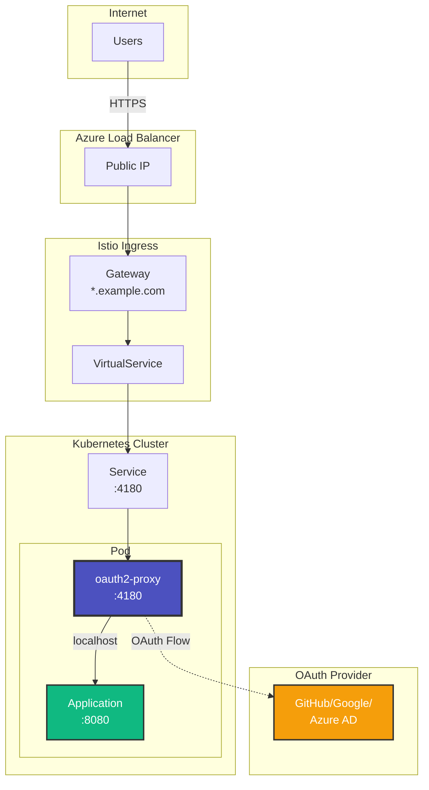
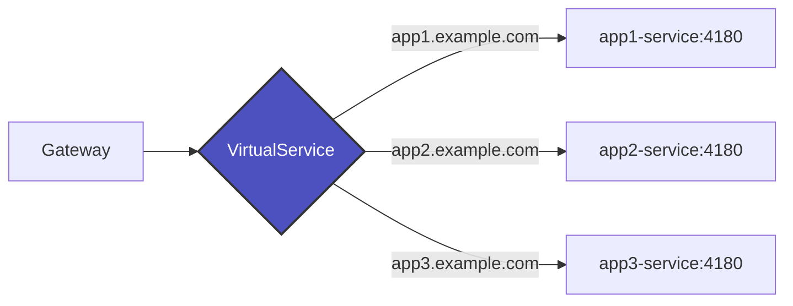
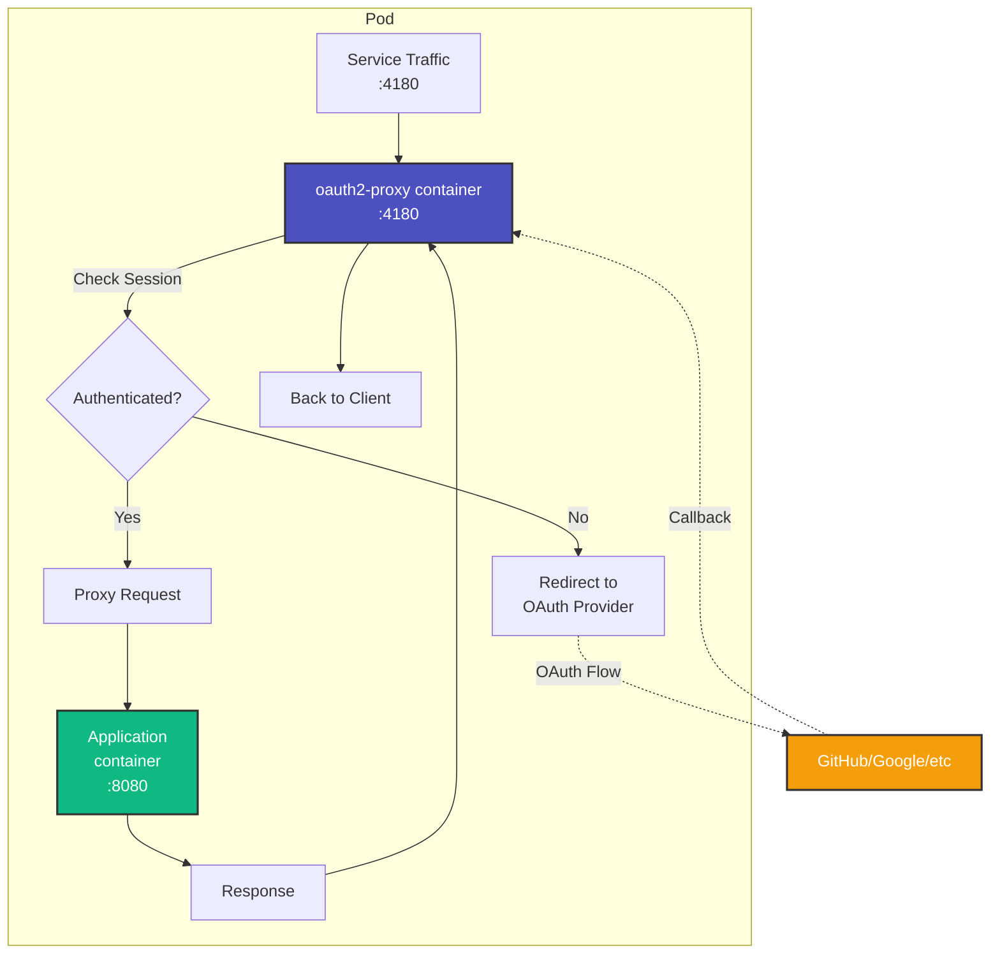
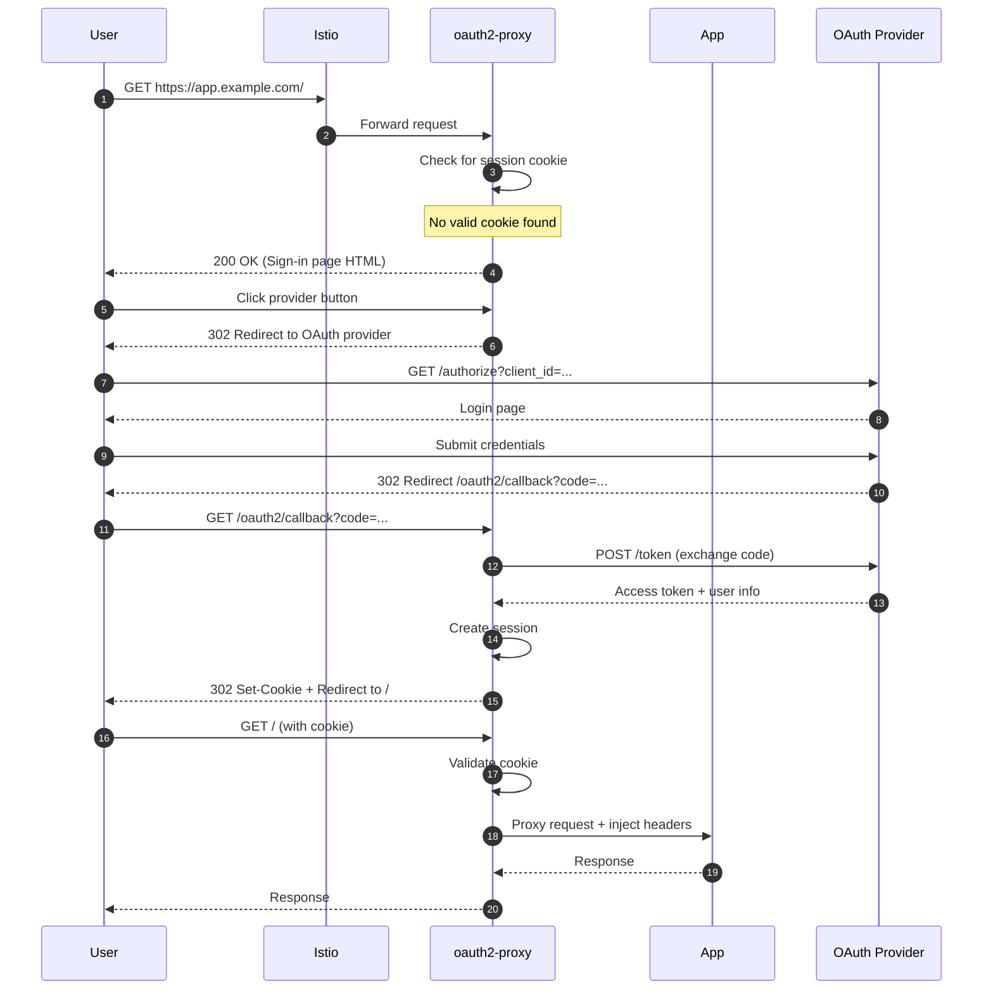
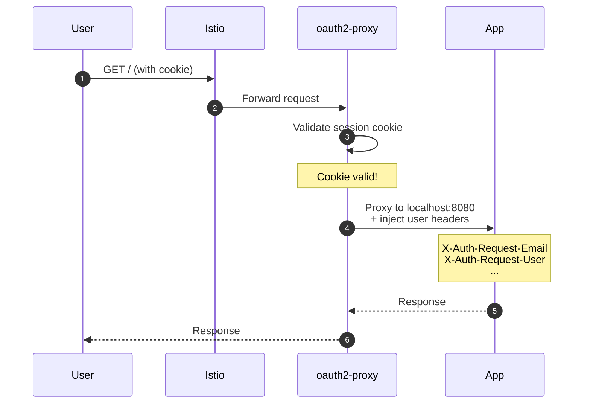
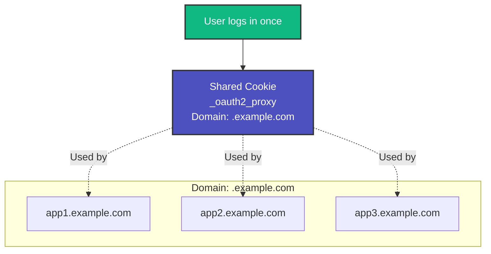

# Architecture Overview

Understanding the OAuth2 Sidecar Proxy architecture and design decisions.

## Design Philosophy

The OAuth2 Sidecar Proxy is built on three core principles:

1. **Simplicity**: Avoid complex centralized authentication services
2. **Isolation**: Each application manages its own authentication lifecycle
3. **Portability**: Applications can easily move between clusters

## High-Level Architecture



## Components

### 1. Istio Ingress Gateway

The entry point for all external traffic to your cluster.

**Responsibilities:**
- TLS termination using wildcard certificate
- HTTP to HTTPS redirect
- Route traffic to application services based on hostname

**Key Configuration:**
```yaml
apiVersion: networking.istio.io/v1beta1
kind: Gateway
metadata:
  name: oauth2-gateway
spec:
  selector:
    istio: ingressgateway
  servers:
  - port:
      number: 443
      name: https
      protocol: HTTPS
    tls:
      mode: SIMPLE
      credentialName: wildcard-tls
    hosts:
    - "*.example.com"
```

### 2. VirtualService

Routes traffic from the Gateway to your application service.

**Responsibilities:**
- Host-based routing (e.g., `app1.example.com` → `app1-service`)
- Directs traffic to port 4180 (oauth2-proxy)



### 3. Service

Kubernetes service that exposes the oauth2-proxy port.

**Key Points:**
- Exposes port 4180 (not your app's port!)
- Type: ClusterIP (internal only)
- Routes to pods with matching labels

### 4. Pod with Sidecar

The core of the architecture: a pod containing both oauth2-proxy and your application.



**Container Details:**

=== "oauth2-proxy Sidecar"

    ```yaml
    - name: oauth2-proxy
      image: quay.io/oauth2-proxy/oauth2-proxy:v7.6.0
      ports:
      - containerPort: 4180
      env:
      - name: OAUTH2_PROXY_REDIRECT_URL
        value: "https://auth.example.com/oauth2/callback"
      - name: OAUTH2_PROXY_UPSTREAMS
        value: "http://127.0.0.1:8080"
      - name: OAUTH2_PROXY_CLIENT_ID
        valueFrom:
          secretKeyRef:
            name: oauth2-proxy-secret
            key: client-id
      # ... more config
    ```

=== "Application Container"

    ```yaml
    - name: app
      image: your-app:latest
      ports:
      - containerPort: 8080
      # Your app listens on 8080
      # Receives authenticated requests from oauth2-proxy
      # Gets user info via headers
    ```

### 5. Configuration

Two main configuration sources:

**ConfigMap** - OAuth2 proxy settings:
```yaml
apiVersion: v1
kind: ConfigMap
metadata:
  name: oauth2-proxy-sidecar-config
data:
  oauth2_proxy.cfg: |
    provider = "github"
    cookie_domains = [".example.com"]
    skip_provider_button = false
    custom_templates_dir = "/templates"
    # ... more settings
```

**Secret** - Sensitive OAuth credentials:
```yaml
apiVersion: v1
kind: Secret
metadata:
  name: oauth2-proxy-secret
type: Opaque
data:
  client-id: <base64>
  client-secret: <base64>
  cookie-secret: <base64>
```

## Authentication Flow

### First Visit (Not Authenticated)



### Subsequent Visits (Authenticated)



## Single Sign-On (SSO)

SSO works by sharing the session cookie across all applications in your domain.



**How it works:**

1. User authenticates to `app1.example.com`
2. Cookie is set with domain `.example.com`
3. User visits `app2.example.com`
4. Browser automatically sends the cookie
5. `app2` validates the cookie ✓
6. User is already authenticated!

## Design Decisions

### Why Sidecar vs. Centralized?

| Aspect | Sidecar Pattern | Centralized Service |
|--------|----------------|---------------------|
| **Configuration** | Simple per-app config | Complex ext_authz setup |
| **Debugging** | Easy - logs with app | Hard - distributed logs |
| **Isolation** | Each app independent | Shared state/failures |
| **Flexibility** | Different providers per app | One provider for all |
| **Portability** | Move apps easily | Tied to infrastructure |
| **Overhead** | ~50MB per app | Single deployment |

!!! success "Sidecar Benefits"
    - **Simpler**: No Istio ext_authz filter needed
    - **More reliable**: No single point of failure
    - **Easier to debug**: Auth logs are with your app
    - **More flexible**: Each app can use different OAuth providers

!!! warning "Centralized Benefits"
    - **Lower resource usage**: One oauth2-proxy for all apps
    - **Centralized management**: Single place to update auth config

For most use cases, the sidecar pattern's benefits outweigh the small resource overhead.

### Why Not Service Mesh mTLS?

Service mesh mTLS provides **service-to-service** authentication but doesn't handle **end-user** authentication. You need both:

- **mTLS**: Encrypts and authenticates service communication
- **OAuth2**: Authenticates end users and provides identity

They complement each other!

### Cookie-Based Sessions

We use cookie-based sessions (not JWT or database-backed sessions) because:

- ✅ **Fast**: No database lookup on every request
- ✅ **Scalable**: Stateless, works with any replica
- ✅ **Simple**: No session store to manage
- ✅ **Secure**: Encrypted, httpOnly, secure flags

The cookie is encrypted with the `cookie-secret`, so even if intercepted, it cannot be read or modified.

## Security Considerations

See the [Security Model](security.md) page for detailed security information.

## Next Steps

- [Learn about the sidecar pattern](sidecar-pattern.md)
- [Understand traffic flow](traffic-flow.md)
- [Review security model](security.md)
