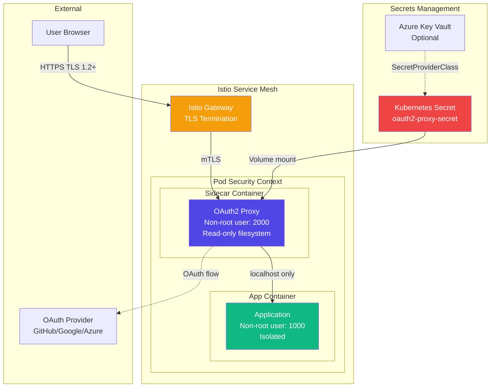
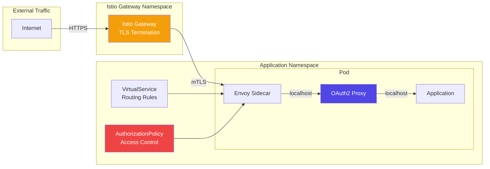

# Security Model

This document describes the security architecture and best practices for the OAuth2 sidecar proxy implementation.

## Security Architecture



## Threat Model

### Assets

1. **User Credentials**: OAuth tokens and session cookies
2. **Application Secrets**: Client ID, client secret, cookie secret
3. **User Data**: Personal information in OAuth claims
4. **Application Data**: Protected application resources

### Threats & Mitigations

#### 1. Man-in-the-Middle (MitM) Attacks

**Threat**: Attacker intercepts traffic between user and gateway

**Mitigations**:
- TLS 1.2+ enforced at Istio Gateway
- HSTS headers enabled
- Certificate pinning recommended for mobile apps
- Mutual TLS (mTLS) within service mesh

```yaml
# Gateway TLS configuration
tls:
  mode: SIMPLE
  minProtocolVersion: TLSV1_2
  credentialName: wildcard-tls-secret
```

#### 2. Session Hijacking

**Threat**: Attacker steals session cookie

**Mitigations**:
- Secure, HttpOnly, SameSite=Lax cookies
- Short cookie lifetime (7 days default)
- Cookie refresh mechanism
- AES-256 encryption of cookie data
- HMAC signature verification

```yaml
cookie_secure = true
cookie_httponly = true
cookie_samesite = "lax"
cookie_expire = "168h"
cookie_refresh = "1h"
```

#### 3. Cross-Site Request Forgery (CSRF)

**Threat**: Malicious site tricks user into making authenticated requests

**Mitigations**:
- SameSite=Lax cookie attribute
- State parameter in OAuth flow
- Origin validation for sensitive operations
- CSRF tokens for state-changing operations

#### 4. OAuth Authorization Code Interception

**Threat**: Attacker intercepts authorization code

**Mitigations**:
- HTTPS-only redirect URIs
- State parameter validation
- PKCE (Proof Key for Code Exchange) support
- Short-lived authorization codes

```yaml
# OAuth configuration
redirect_url = "https://auth.example.com/oauth2/callback"
# State parameter automatically generated and validated
```

#### 5. Container Escape

**Threat**: Attacker escapes sidecar container

**Mitigations**:
- Non-root user (UID 2000)
- Read-only root filesystem
- Dropped capabilities
- Pod security policies/standards
- No privilege escalation

```yaml
securityContext:
  runAsNonRoot: true
  runAsUser: 2000
  allowPrivilegeEscalation: false
  readOnlyRootFilesystem: true
  capabilities:
    drop:
      - ALL
```

#### 6. Secrets Exposure

**Threat**: Secrets leaked through logs, environment variables, or filesystem

**Mitigations**:
- Secrets stored in Kubernetes Secrets
- Volume mounts (not environment variables)
- Azure Key Vault integration available
- No secrets in logs or error messages
- Secret rotation support

```yaml
# Secret mounted as volume
volumeMounts:
  - name: oauth2-proxy-secret
    mountPath: /secrets
    readOnly: true
```

## Authentication Security

### OAuth Provider Selection

Choose providers with strong security practices:

| Provider | Security Features |
|----------|------------------|
| **GitHub** | 2FA support, OAuth apps, fine-grained permissions |
| **Google** | Advanced Protection Program, OAuth 2.0 security best practices |
| **Azure AD** | Conditional Access, MFA, Enterprise security |
| **OIDC** | Flexible, standards-based, configurable security |

### Scopes and Permissions

Request minimal necessary scopes:

```yaml
# GitHub minimal scopes
scope = "user:email read:org"

# Google minimal scopes  
scope = "openid email profile"

# Azure AD minimal scopes
scope = "openid email profile"
```

### Token Management

**Access Token Storage**:
- Stored encrypted in session cookie
- Never logged or exposed to application
- Automatic refresh if provider supports it

**Cookie Secret Rotation**:

```bash
# Generate new secret
openssl rand -base64 32

# Update Kubernetes secret
kubectl create secret generic oauth2-proxy-secret \
  --from-literal=cookie-secret=NEW_SECRET \
  --dry-run=client -o yaml | kubectl apply -f -

# Restart pods
kubectl rollout restart deployment/example-app
```

## Network Security

### Istio Service Mesh



### Network Policies

Restrict traffic to/from OAuth2 proxy:

```yaml
apiVersion: networking.k8s.io/v1
kind: NetworkPolicy
metadata:
  name: oauth2-proxy-network-policy
spec:
  podSelector:
    matchLabels:
      app: example-app
  policyTypes:
    - Ingress
    - Egress
  ingress:
    # Only from Istio ingress gateway
    - from:
      - namespaceSelector:
          matchLabels:
            name: istio-system
      ports:
        - protocol: TCP
          port: 4180
  egress:
    # DNS
    - to:
      - namespaceSelector:
          matchLabels:
            name: kube-system
      ports:
        - protocol: UDP
          port: 53
    # OAuth provider (GitHub, Google, etc.)
    - to:
      - podSelector: {}
      ports:
        - protocol: TCP
          port: 443
```

### Localhost Communication

Sidecar to application communication is restricted to localhost:

```yaml
# OAuth2 proxy upstream configuration
OAUTH2_PROXY_UPSTREAMS=http://127.0.0.1:8080

# Application listens only on localhost
args:
  - -listen=:8080  # Binds to 127.0.0.1:8080
```

**Benefits**:
- Cannot be accessed from outside the pod
- No network policy needed for pod-internal traffic
- Minimizes attack surface

## Authorization

### Istio AuthorizationPolicy

Enforce that all requests go through OAuth2 proxy:

```yaml
apiVersion: security.istio.io/v1
kind: AuthorizationPolicy
metadata:
  name: require-oauth2-auth
  namespace: default
spec:
  action: DENY
  rules:
    # Deny direct access to application port
    - to:
      - operation:
          ports: ["8080"]
    # Allow only from localhost (sidecar)
    - from:
      - source:
          notPrincipals: ["cluster.local/ns/default/sa/example-app"]
```

### Email Domain Restrictions

Restrict access by email domain:

```yaml
# Allow only company domain
email_domains = ["example.com"]

# Allow multiple domains
email_domains = ["example.com", "partner.com"]

# Allow all domains (not recommended for production)
email_domains = ["*"]
```

### GitHub Organization/Team Restrictions

```yaml
# GitHub organization
--github-org="mycompany"

# GitHub team (requires org)
--github-org="mycompany"
--github-team="engineering"
```

### Custom Authorization

Implement custom authorization in your application using headers:

```python
# Python Flask example
from functools import wraps
from flask import request, abort

def require_admin(f):
    @wraps(f)
    def decorated(*args, **kwargs):
        email = request.headers.get('X-Auth-Request-Email')
        if not email or not email.endswith('@example.com'):
            abort(403)
        # Check if user is admin in your database
        if not is_admin(email):
            abort(403)
        return f(*args, **kwargs)
    return decorated

@app.route('/admin')
@require_admin
def admin_panel():
    return "Admin Panel"
```

## Logging and Monitoring

### Security Audit Logging

Enable comprehensive logging:

```yaml
# OAuth2 proxy configuration
standard-logging = true
auth-logging = true
request-logging = true
logging-level = "info"
```

### Sensitive Data Redaction

OAuth2-proxy automatically redacts:
- Cookie values
- Authorization headers
- Access tokens
- Client secrets

### Monitoring Metrics

Key security metrics to monitor:

```yaml
# Prometheus metrics
oauth2_proxy_requests_total{method="GET",path="/oauth2/sign_in"}
oauth2_proxy_authentication_failures_total
oauth2_proxy_authentication_attempts_total
oauth2_proxy_cookies_expired_total
```

### Security Alerts

Set up alerts for:

1. **High authentication failure rate**
   ```promql
   rate(oauth2_proxy_authentication_failures_total[5m]) > 10
   ```

2. **Unusual access patterns**
   ```promql
   sum(rate(oauth2_proxy_requests_total[5m])) by (path) > 1000
   ```

3. **Token refresh failures**
   ```promql
   rate(oauth2_proxy_token_refresh_errors_total[5m]) > 1
   ```

## Compliance

### GDPR Considerations

**Data Minimization**:
- Request only necessary OAuth scopes
- Don't store unnecessary user data
- Implement data retention policies

**Right to Erasure**:
- Provide sign-out functionality
- Clear all session data on sign-out
- Implement account deletion workflows

**Data Portability**:
- Expose user data through API
- Allow users to download their data

### SOC 2 / ISO 27001

**Access Control**:
- Strong authentication required
- Role-based access control (RBAC)
- Audit logging enabled

**Encryption**:
- TLS 1.2+ for data in transit
- AES-256 for session cookies
- Secrets encrypted at rest in Kubernetes

**Incident Response**:
- Centralized logging
- Security event monitoring
- Automated alerting

## Security Best Practices

### Development

1. **Keep Dependencies Updated**
   ```bash
   # Update oauth2-proxy image
   image: quay.io/oauth2-proxy/oauth2-proxy:v7.6.0
   ```

2. **Use Specific Image Tags**
   - Don't use `latest` tag
   - Pin to specific versions
   - Test updates in staging first

3. **Scan Images for Vulnerabilities**
   ```bash
   trivy image quay.io/oauth2-proxy/oauth2-proxy:v7.6.0
   ```

### Deployment

1. **Use Azure Key Vault for Secrets**
   ```yaml
   apiVersion: secrets-store.csi.x-k8s.io/v1
   kind: SecretProviderClass
   metadata:
     name: oauth2-proxy-azure-kv
   spec:
     provider: azure
     parameters:
       keyvaultName: "my-key-vault"
       objects: |
         array:
           - objectName: "oauth2-client-id"
             objectType: "secret"
           - objectName: "oauth2-client-secret"
             objectType: "secret"
   ```

2. **Enable Pod Security Standards**
   ```yaml
   apiVersion: v1
   kind: Namespace
   metadata:
     name: default
     labels:
       pod-security.kubernetes.io/enforce: restricted
       pod-security.kubernetes.io/audit: restricted
       pod-security.kubernetes.io/warn: restricted
   ```

3. **Implement Network Segmentation**
   - Separate namespaces for different apps
   - Network policies between namespaces
   - Egress filtering for external services

### Operations

1. **Regular Security Audits**
   - Review access logs weekly
   - Audit OAuth application configurations
   - Check for unused service accounts

2. **Incident Response Plan**
   - Document escalation procedures
   - Practice incident response drills
   - Maintain runbooks for common issues

3. **Secret Rotation Schedule**
   - Rotate cookie secrets quarterly
   - Rotate OAuth credentials annually
   - Rotate TLS certificates before expiry

## Security Checklist

### Pre-Production

- [ ] TLS 1.2+ enforced on Istio Gateway
- [ ] Certificate from trusted CA installed
- [ ] OAuth provider application configured with correct callback URL
- [ ] Email domain restrictions configured (if applicable)
- [ ] Cookie secrets generated with sufficient entropy
- [ ] Secrets stored in Kubernetes Secrets or Key Vault
- [ ] Pod Security Standards enabled
- [ ] Network policies defined
- [ ] Resource limits set on containers
- [ ] Non-root users configured
- [ ] Read-only root filesystem enabled
- [ ] All capabilities dropped

### Production

- [ ] Monitoring and alerting configured
- [ ] Log aggregation and retention configured
- [ ] Incident response plan documented
- [ ] Security audit logging enabled
- [ ] Regular vulnerability scanning scheduled
- [ ] Secret rotation schedule defined
- [ ] Backup and disaster recovery plan
- [ ] Compliance requirements met

### Ongoing

- [ ] Review access logs monthly
- [ ] Update dependencies quarterly
- [ ] Rotate secrets per schedule
- [ ] Audit OAuth configurations quarterly
- [ ] Review and update security policies annually

## Resources

- [OAuth 2.0 Security Best Practices](https://datatracker.ietf.org/doc/html/draft-ietf-oauth-security-topics)
- [OAuth2-Proxy Documentation](https://oauth2-proxy.github.io/oauth2-proxy/)
- [Istio Security Best Practices](https://istio.io/latest/docs/ops/best-practices/security/)
- [Kubernetes Security Best Practices](https://kubernetes.io/docs/concepts/security/pod-security-standards/)
- [OWASP Top 10](https://owasp.org/www-project-top-ten/)

## Next Steps

- [Configure OAuth Providers](../configuration/oauth-providers.md)
- [Production Deployment Guide](../deployment/production.md)
- [Troubleshooting Security Issues](../guides/troubleshooting.md)
