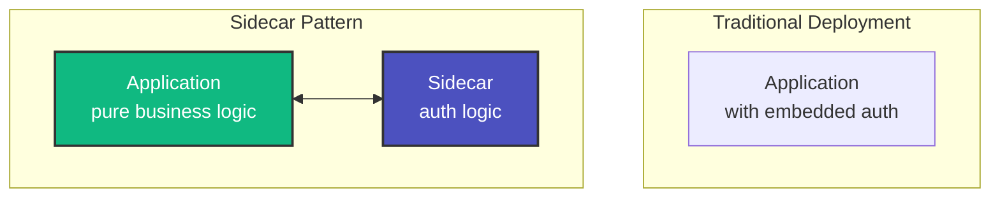
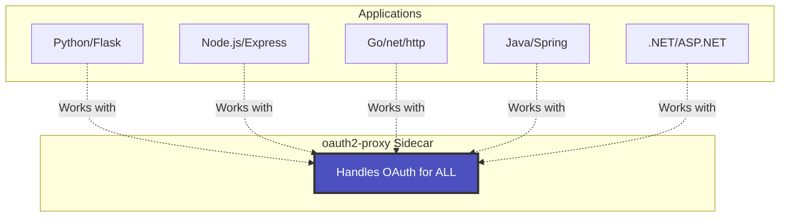
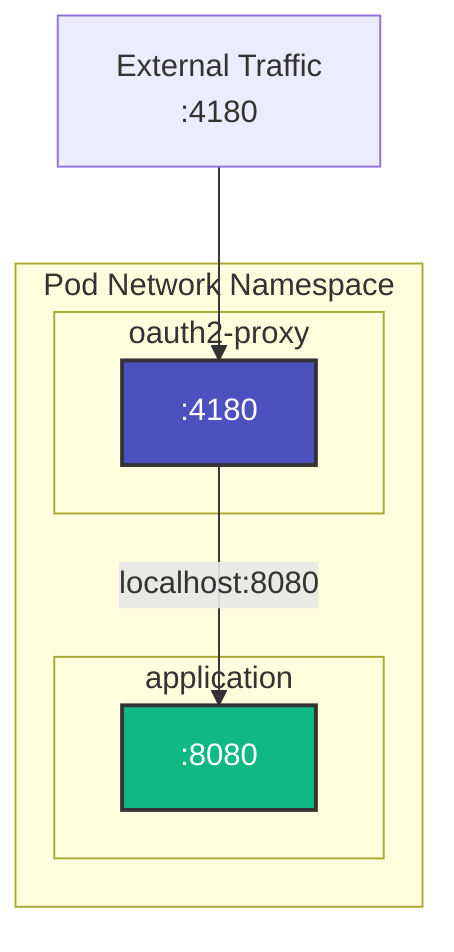
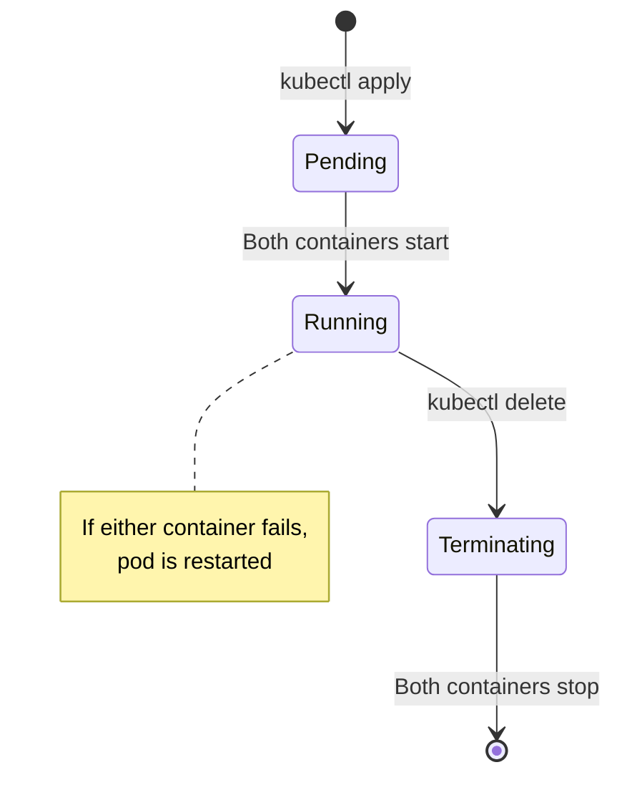
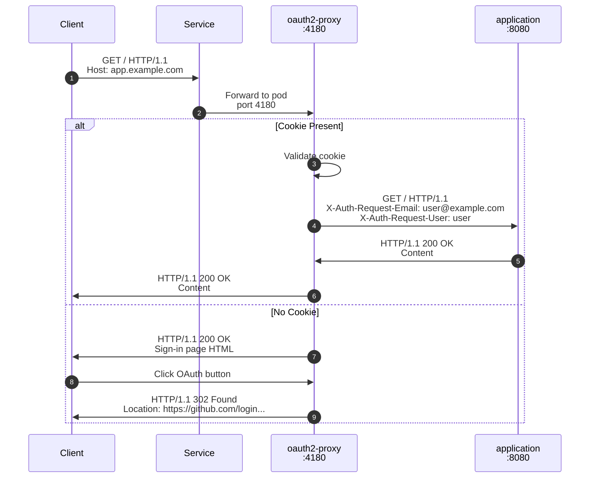
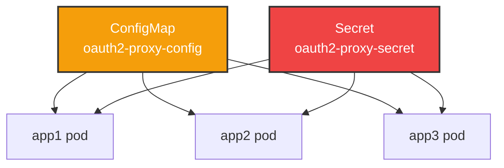
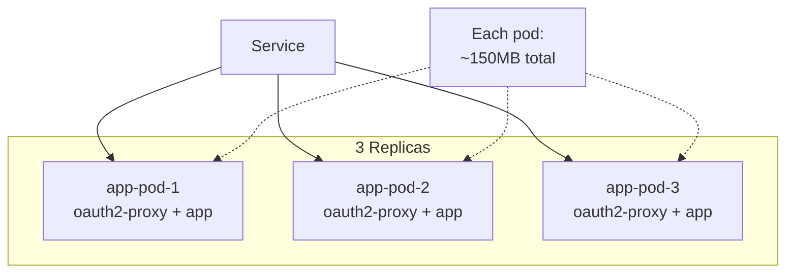
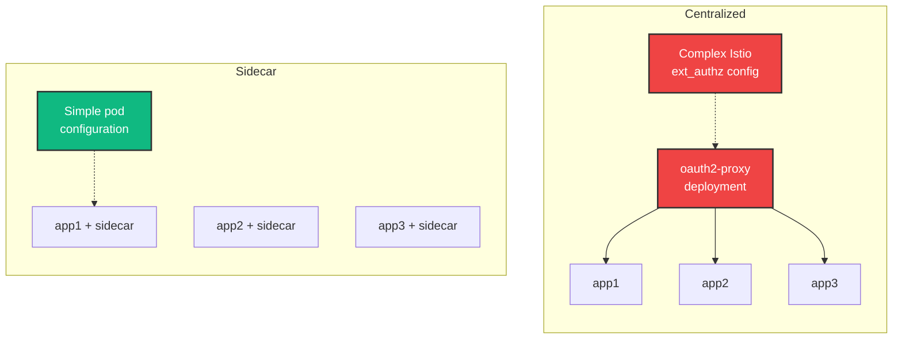
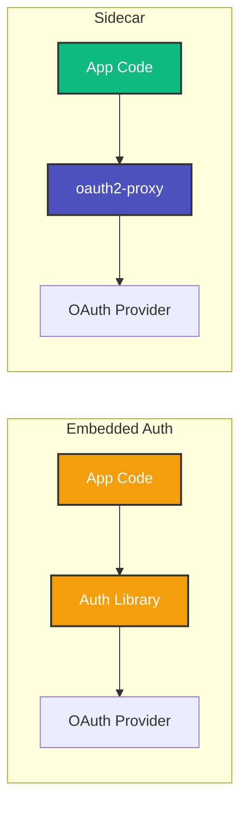

# Sidecar Pattern Deep Dive

Understanding the sidecar pattern and how it applies to OAuth2 authentication.

## What is the Sidecar Pattern?

The sidecar pattern is a microservices design pattern where auxiliary functionality is deployed alongside the main application container in the same pod. The sidecar container extends and enhances the main container's behavior.



## Benefits for Authentication

### 1. Separation of Concerns

Your application focuses on business logic, while the sidecar handles authentication.

**Without sidecar:**
```python
# Your app code mixed with auth logic
from flask import Flask, session, redirect
import oauth_lib

app = Flask(__name__)

@app.route('/')
def index():
    if not session.get('user'):
        return redirect('/login')
    # Business logic here
    return f"Hello {session['user']}"

@app.route('/login')
def login():
    # OAuth dance...
    return oauth_lib.authorize()
```

**With sidecar:**
```python
# Your app code - pure business logic
from flask import Flask, request

app = Flask(__name__)

@app.route('/')
def index():
    # User is already authenticated by sidecar
    user = request.headers.get('X-Auth-Request-User')
    return f"Hello {user}"
```

### 2. Language Agnostic

The sidecar works with any programming language or framework.



### 3. Easy Updates

Update authentication logic without changing application code.


### 4. Consistent Security

All applications get the same security controls automatically.

## Pod Architecture

### Network Sharing

Containers in the same pod share the same network namespace, enabling communication via `localhost`.



**Key Points:**
- oauth2-proxy listens on `:4180` (exposed externally via Service)
- Application listens on `:8080` (only accessible within pod)
- Communication is fast (localhost, no network overhead)
- Application port is never exposed externally

### Volume Sharing

Containers can share volumes for configuration and templates.

```yaml
spec:
  containers:
  - name: oauth2-proxy
    volumeMounts:
    - name: config
      mountPath: /etc/oauth2-proxy
    - name: templates
      mountPath: /templates
  
  - name: app
    volumeMounts:
    - name: app-config
      mountPath: /etc/app
  
  volumes:
  - name: config
    configMap:
      name: oauth2-proxy-config
  - name: templates
    configMap:
      name: oauth2-proxy-templates
  - name: app-config
    configMap:
      name: app-config
```

### Lifecycle Management

Both containers start and stop together.



## Request Flow

### Detailed Request Flow



### Header Injection

The oauth2-proxy sidecar automatically injects user information:

| Header | Description | Example |
|--------|-------------|---------|
| `X-Auth-Request-User` | User identifier | `octocat` |
| `X-Auth-Request-Email` | User email | `octocat@github.com` |
| `X-Auth-Request-Preferred-Username` | Preferred username | `octocat` |
| `X-Forwarded-User` | Forwarded user | `octocat` |
| `X-Forwarded-Email` | Forwarded email | `octocat@github.com` |
| `Authorization` | Bearer token (optional) | `Bearer eyJ...` |

## Configuration

### Pod-Level Configuration

Each pod can have its own authentication configuration.

```yaml
apiVersion: apps/v1
kind: Deployment
metadata:
  name: app1
spec:
  template:
    spec:
      containers:
      - name: oauth2-proxy
        env:
        # App-specific redirect URL
        - name: OAUTH2_PROXY_REDIRECT_URL
          value: "https://app1.example.com/oauth2/callback"
        # App-specific upstream
        - name: OAUTH2_PROXY_UPSTREAMS
          value: "http://127.0.0.1:8080"
```

### Shared Configuration

Common settings are shared via ConfigMap.



**Shared via ConfigMap:**
- OAuth provider type
- Cookie settings
- Email domain restrictions
- Template configuration

**Shared via Secret:**
- OAuth client ID & secret
- Cookie encryption secret

**Per-pod via Environment:**
- Redirect URL (app-specific)
- Upstream port (app-specific)

## Resource Management

### Resource Requests and Limits

Each sidecar has its own resource allocation.

```yaml
containers:
- name: oauth2-proxy
  resources:
    requests:
      memory: "64Mi"
      cpu: "50m"
    limits:
      memory: "128Mi"
      cpu: "200m"

- name: app
  resources:
    requests:
      memory: "256Mi"
      cpu: "100m"
    limits:
      memory: "512Mi"
      cpu: "500m"
```

**Typical Resource Usage:**

| Container | Memory | CPU | Notes |
|-----------|--------|-----|-------|
| oauth2-proxy | 50-100 MB | 10-50m | Low overhead |
| Application | Varies | Varies | Your app's needs |

### Scaling Considerations



**Scaling Impact:**
- Each replica adds one oauth2-proxy sidecar
- At 10 replicas × 100MB = 1GB overhead
- Trade-off: More memory for better isolation

## Comparison with Alternatives

### vs. Centralized oauth2-proxy



| Feature | Sidecar | Centralized |
|---------|---------|-------------|
| Configuration | ✅ Simple | ❌ Complex |
| Debugging | ✅ Easy | ❌ Distributed |
| Isolation | ✅ Per-app | ❌ Shared |
| Flexibility | ✅ Per-app providers | ❌ Single provider |
| Resources | ⚠️ Higher | ✅ Lower |
| Portability | ✅ Easy | ❌ Infrastructure-tied |

### vs. Application-Embedded Auth



| Aspect | Sidecar | Embedded |
|--------|---------|----------|
| Code changes | ✅ None needed | ❌ Must implement |
| Language support | ✅ Any language | ⚠️ Library dependent |
| Security updates | ✅ Update image | ❌ Code change + deploy |
| Consistency | ✅ Same for all apps | ❌ Varies by app |
| Testing | ✅ Test separately | ❌ Test with app |

## Best Practices

### 1. Use Shared ConfigMaps

Create one ConfigMap for common settings, environment variables for app-specific settings.

### 2. Monitor Both Containers

```bash
# Check both containers
kubectl logs pod-name -c oauth2-proxy
kubectl logs pod-name -c app
```

### 3. Health Checks

Configure health checks for both containers:

```yaml
containers:
- name: oauth2-proxy
  livenessProbe:
    httpGet:
      path: /ping
      port: 4180
  readinessProbe:
    httpGet:
      path: /ping
      port: 4180

- name: app
  livenessProbe:
    httpGet:
      path: /health
      port: 8080
```

### 4. Resource Limits

Always set resource limits to prevent resource contention.

### 5. Logging

Structure logs for easy correlation:

```json
{
  "container": "oauth2-proxy",
  "pod": "app-7d8f6b-abc123",
  "level": "info",
  "msg": "Authentication successful"
}
```

## Next Steps

- [Understand traffic flow in detail](traffic-flow.md)
- [Learn about security considerations](security.md)
- [Add sidecar to your app](../guide/adding-apps.md)
