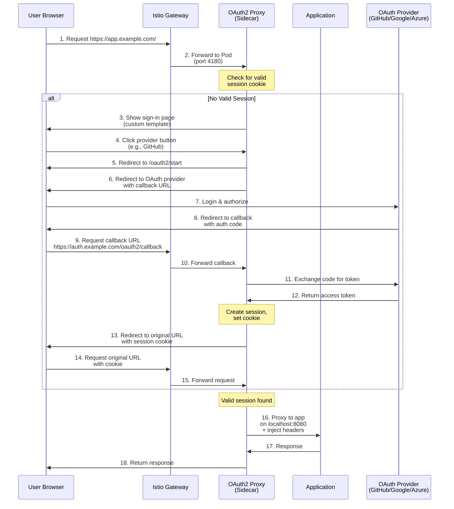
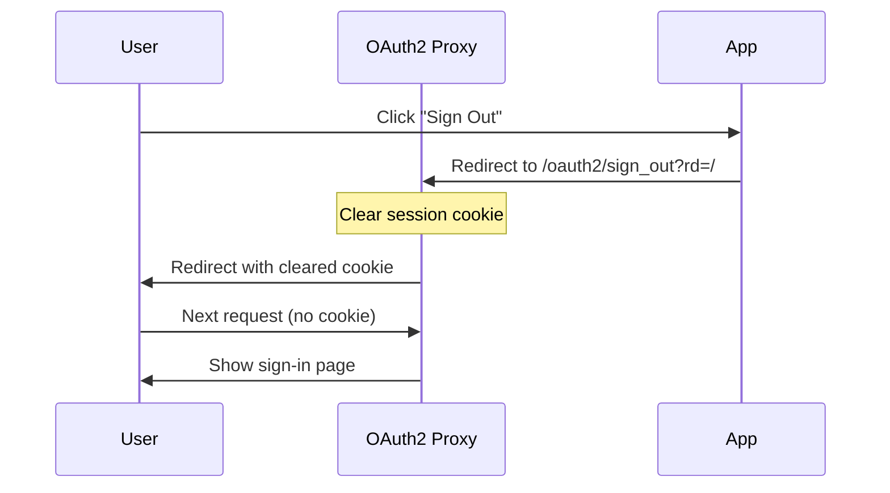
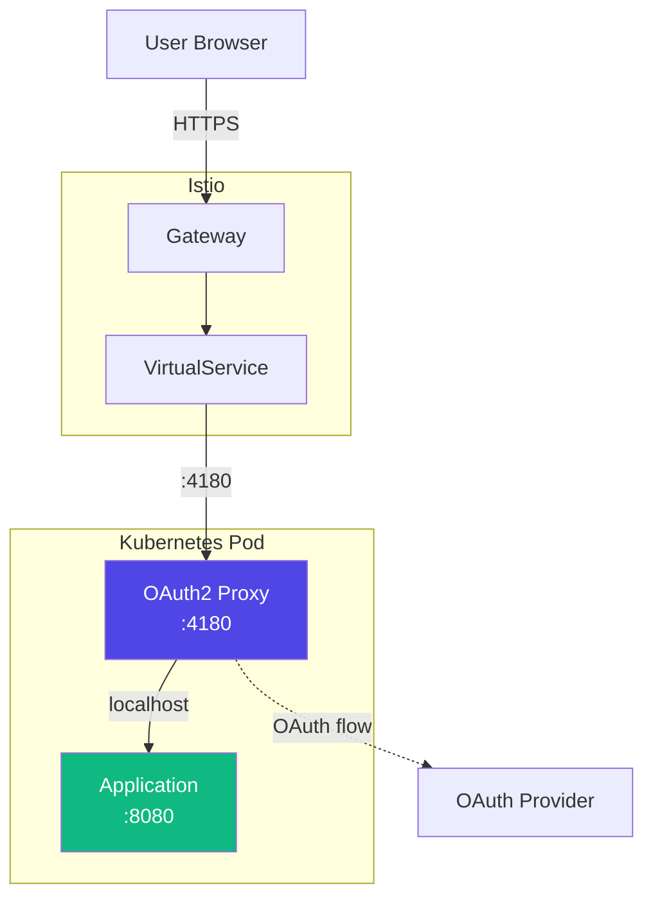

# OAuth Authentication Flow

This document describes the complete OAuth2 authentication flow when using the sidecar pattern.

## Overview

The OAuth2 sidecar proxy handles authentication transparently, redirecting unauthenticated users through an OAuth flow and maintaining session cookies for authenticated users.

## Authentication Flow Diagram



## Step-by-Step Flow

### 1. Initial Request (Unauthenticated)

When a user first visits `https://app.example.com/`, they don't have a valid session cookie:

```http
GET / HTTP/1.1
Host: app.example.com
```

### 2. Sign-in Page Display

The OAuth2 proxy sidecar checks for a session cookie. If none is found or it's expired, the proxy serves a custom sign-in page instead of auto-redirecting:

```yaml
# ConfigMap configuration
skip_provider_button = false
custom_templates_dir = "/templates"
```

The sign-in page displays provider options (GitHub, Google, etc.) with branded buttons.

### 3. OAuth Provider Selection

When the user clicks a provider button (e.g., "Sign in with GitHub"), the browser navigates to:

```
https://app.example.com/oauth2/start
```

### 4. Redirect to OAuth Provider

The sidecar generates an OAuth authorization URL and redirects:

```http
HTTP/1.1 302 Found
Location: https://github.com/login/oauth/authorize?
  client_id=YOUR_CLIENT_ID
  &redirect_uri=https://auth.example.com/oauth2/callback
  &response_type=code
  &scope=user:email read:org
  &state=ENCRYPTED_STATE_WITH_RETURN_URL
```

Key parameters:

- `redirect_uri`: Centralized callback domain (e.g., `auth.example.com`)
- `state`: Encrypted state containing the original return URL
- `scope`: Requested OAuth scopes

### 5. User Authorization

The user authenticates with the OAuth provider (GitHub, Google, Azure AD, etc.) and grants permissions.

### 6. Callback with Authorization Code

The OAuth provider redirects back to the callback URL with an authorization code:

```
https://auth.example.com/oauth2/callback?
  code=AUTHORIZATION_CODE
  &state=ENCRYPTED_STATE_WITH_RETURN_URL
```

### 7. Token Exchange

The sidecar exchanges the authorization code for an access token:

```http
POST https://github.com/login/oauth/access_token
Content-Type: application/x-www-form-urlencoded

client_id=YOUR_CLIENT_ID
&client_secret=YOUR_CLIENT_SECRET
&code=AUTHORIZATION_CODE
&redirect_uri=https://auth.example.com/oauth2/callback
```

Response:

```json
{
  "access_token": "gho_xxxxxxxxxxxxx",
  "token_type": "bearer",
  "scope": "user:email,read:org"
}
```

### 8. Session Creation

The sidecar creates a session and sets a secure cookie:

```http
HTTP/1.1 302 Found
Location: https://app.example.com/
Set-Cookie: _oauth2_proxy=ENCRYPTED_SESSION_DATA; 
  Domain=.example.com; 
  Path=/; 
  Secure; 
  HttpOnly; 
  SameSite=Lax; 
  Max-Age=604800
```

Cookie characteristics:

- **Domain**: `.example.com` (enables SSO across subdomains)
- **Secure**: Only sent over HTTPS
- **HttpOnly**: Not accessible to JavaScript
- **SameSite=Lax**: Protects against CSRF
- **Max-Age**: 7 days (configurable)

### 9. Authenticated Request

Subsequent requests include the session cookie:

```http
GET /dashboard HTTP/1.1
Host: app.example.com
Cookie: _oauth2_proxy=ENCRYPTED_SESSION_DATA
```

### 10. Request Proxying with Headers

The sidecar validates the session and proxies the request to the application container, injecting user information as headers:

```http
GET /dashboard HTTP/1.1
Host: localhost:8080
X-Auth-Request-User: john.doe
X-Auth-Request-Email: john.doe@example.com
X-Auth-Request-Preferred-Username: johndoe
X-Auth-Request-Access-Token: gho_xxxxxxxxxxxxx
Authorization: Bearer gho_xxxxxxxxxxxxx
```

## Centralized vs. Per-App Callbacks

### Centralized Callback Domain

The sidecar architecture uses a centralized callback domain for all applications:

```
https://auth.example.com/oauth2/callback
```

**Benefits:**

- Single OAuth app configuration per provider
- Shared SSO cookie across all apps
- Simplified DNS and certificate management
- Consistent user experience

### Configuration

```yaml
# Deployment environment variable
- name: OAUTH2_PROXY_REDIRECT_URL
  value: "https://auth.example.com/oauth2/callback"

# ConfigMap
cookie_domains = [".example.com"]
whitelist_domains = [".example.com"]
```

## Session Management

### Cookie Structure

The session cookie contains encrypted data:

```
_oauth2_proxy=v4|encrypted_data|signature
```

Components:

- **Version**: Cookie format version
- **Encrypted Data**: User email, access token, expiry
- **Signature**: HMAC signature for integrity

### Cookie Refresh

Cookies are automatically refreshed:

```yaml
cookie_expire = "168h"  # 7 days total lifetime
cookie_refresh = "1h"   # Refresh if older than 1 hour
```

When a cookie is older than 1 hour but younger than 7 days, the sidecar refreshes it by validating the access token and issuing a new cookie.

## Sign Out Flow



Sign-out URL format:

```
/oauth2/sign_out?rd=https://app.example.com/
```

The `rd` parameter specifies where to redirect after sign-out.

## Security Considerations

### State Parameter

The `state` parameter prevents CSRF attacks:

```
state = encrypt(original_url + timestamp + random_nonce)
```

The sidecar validates the state parameter on callback to ensure the request originated from the same session.

### Cookie Security

Cookies are encrypted using AES-256 with a secret key:

```yaml
# Kubernetes Secret
OAUTH2_PROXY_COOKIE_SECRET: <base64-encoded-32-byte-key>
```

### Token Storage

Access tokens are stored encrypted in the session cookie, not in server-side storage. This enables stateless operation across multiple sidecar instances.

## Error Handling

### Common Error Scenarios

1. **Invalid/Expired Session**
   - Clear cookie and redirect to sign-in page

2. **OAuth Provider Error**
   - Display custom error page with details
   - Allow user to retry

3. **Invalid State Parameter**
   - Clear session and redirect to sign-in
   - Log security event

4. **Token Refresh Failure**
   - Clear session and require re-authentication

### Custom Error Pages

Configure custom error templates:

```yaml
custom_templates_dir = "/templates"
# error.html template available
```

## Network Flow Architecture



## Configuration Reference

### Deployment Configuration

```yaml
env:
  - name: OAUTH2_PROXY_REDIRECT_URL
    value: "https://auth.example.com/oauth2/callback"
  - name: OAUTH2_PROXY_UPSTREAMS
    value: "http://127.0.0.1:8080"
  - name: OAUTH2_PROXY_CLIENT_ID
    valueFrom:
      secretKeyRef:
        name: oauth2-proxy-secret
        key: client-id
  - name: OAUTH2_PROXY_CLIENT_SECRET
    valueFrom:
      secretKeyRef:
        name: oauth2-proxy-secret
        key: client-secret
  - name: OAUTH2_PROXY_COOKIE_SECRET
    valueFrom:
      secretKeyRef:
        name: oauth2-proxy-secret
        key: cookie-secret
```

### ConfigMap Settings

```ini
provider = "github"
http_address = "0.0.0.0:4180"
cookie_domains = [".example.com"]
cookie_secure = true
cookie_httponly = true
cookie_samesite = "lax"
cookie_expire = "168h"
cookie_refresh = "1h"
email_domains = ["*"]
skip_provider_button = false
custom_templates_dir = "/templates"
reverse_proxy = true
```

## Testing the Flow

### 1. Test Unauthenticated Access

```bash
curl -I https://app.example.com/
# Should return custom sign-in page HTML
```

### 2. Test OAuth Start Endpoint

```bash
curl -I https://app.example.com/oauth2/start
# Should redirect to OAuth provider
```

### 3. Test with Cookie

```bash
curl -I https://app.example.com/ \
  -H "Cookie: _oauth2_proxy=VALID_COOKIE"
# Should return 200 OK
```

### 4. Test Logout

```bash
curl -I "https://app.example.com/oauth2/sign_out?rd=/"
# Should clear cookie and redirect
```

## Next Steps

- [Configure OAuth Providers](../configuration/oauth-providers.md)
- [Customize Sign-in Pages](../configuration/templates.md)
- [Production Deployment](../deployment/production.md)
- [Troubleshooting](../guides/troubleshooting.md)
