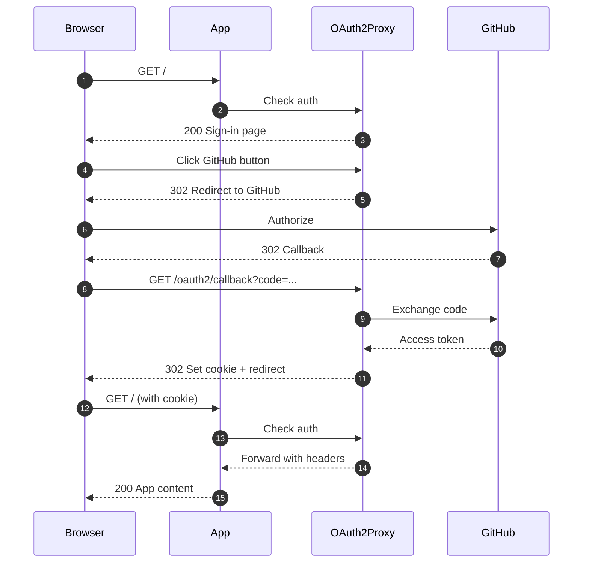

# Quick Start

Get OAuth2 authentication running on your Kubernetes cluster in under 10 minutes.

## Prerequisites

Before you begin, ensure you have:

- [x] Kubernetes cluster (1.20+) with kubectl access
- [x] Istio service mesh installed (1.14+)
- [x] Helm 3 installed
- [x] A domain with DNS access (e.g., `example.com`)
- [x] OAuth application credentials (we'll use GitHub in this guide)

## Step 1: Register OAuth Application

=== "GitHub"

    1. Go to [GitHub Settings → Developer Settings → OAuth Apps](https://github.com/settings/developers)
    2. Click **"New OAuth App"**
    3. Fill in the details:
        - **Application name**: `My App SSO`
        - **Homepage URL**: `https://example.com`
        - **Authorization callback URL**: `https://auth.example.com/oauth2/callback`
    4. Save the **Client ID** and **Client Secret**

=== "Google"

    1. Go to [Google Cloud Console](https://console.cloud.google.com/)
    2. Create a new project or select existing
    3. Navigate to **APIs & Services → Credentials**
    4. Click **Create Credentials → OAuth client ID**
    5. Select **Web application**
    6. Add authorized redirect URI: `https://auth.example.com/oauth2/callback`
    7. Save the **Client ID** and **Client Secret**

=== "Azure AD"

    1. Go to [Azure Portal](https://portal.azure.com/)
    2. Navigate to **Azure Active Directory → App registrations**
    3. Click **New registration**
    4. Fill in the details:
        - **Name**: `My App SSO`
        - **Redirect URI**: `https://auth.example.com/oauth2/callback`
    5. Go to **Certificates & secrets** → Create new client secret
    6. Save the **Application (client) ID** and **Client Secret**

## Step 2: Configure DNS

Point a wildcard DNS record to your Istio ingress gateway:

```bash
# Get your Istio ingress gateway IP
kubectl get svc -n istio-system istio-ingressgateway

# Create DNS A record
# Name: *.example.com
# Type: A
# Value: <INGRESS_IP>
```

## Step 3: Install with Helm

Create a values file with your configuration:

```yaml title="my-values.yaml"
# Domain configuration
domain: example.com
cookieDomain: .example.com

# OAuth provider configuration
oauth:
  provider: github
  clientID: "your-client-id"
  clientSecret: "your-client-secret"
  # Cookie secret will be auto-generated

# Istio configuration
istio:
  enabled: true
  gateway:
    create: true
    name: oauth2-gateway
    hosts:
      - "*.example.com"
    tls:
      mode: SIMPLE
      credentialName: wildcard-tls  # Your TLS cert secret

# Custom branding
customTemplates:
  enabled: true
  brandName: "My Company SSO"
```

Install the Helm chart:

```bash
helm install oauth2-sidecar ./helm/oauth2-sidecar \
  --values my-values.yaml \
  --namespace default \
  --create-namespace
```

!!! success "Installation Complete"
    The base OAuth2 infrastructure is now ready! 🎉

## Step 4: Deploy Example Application

Deploy the example app to test the setup:

```bash
kubectl apply -k k8s/apps/example-app/
```

Wait for the pod to be ready:

```bash
kubectl get pods -l app=example-app -w
```

## Step 5: Test Authentication

Open your browser and navigate to:

```
https://example-app.example.com
```

You should see:

1. **Sign-in page** with your provider button
2. **Click the button** → Redirects to OAuth provider
3. **Authorize the app** → Redirects back to your app
4. **Success!** You're now authenticated



## Step 6: Access User Information

Your application receives user information via HTTP headers:

```bash
# Test with curl (after authenticating in browser)
curl -v https://example-app.example.com/headers \
  -H "Cookie: _oauth2_proxy=<your-cookie>"
```

Headers available to your app:

- `X-Auth-Request-User`: Username
- `X-Auth-Request-Email`: Email address
- `X-Auth-Request-Preferred-Username`: Preferred username
- `X-Forwarded-User`: User identifier
- `X-Forwarded-Email`: Email address

Example in your app:

=== "Python (Flask)"

    ```python
    from flask import Flask, request
    
    app = Flask(__name__)
    
    @app.route('/')
    def index():
        user_email = request.headers.get('X-Auth-Request-Email')
        username = request.headers.get('X-Auth-Request-User')
        return f'Hello {username} ({user_email})!'
    ```

=== "Node.js (Express)"

    ```javascript
    const express = require('express');
    const app = express();
    
    app.get('/', (req, res) => {
      const userEmail = req.headers['x-auth-request-email'];
      const username = req.headers['x-auth-request-user'];
      res.send(`Hello ${username} (${userEmail})!`);
    });
    ```

=== "Go"

    ```go
    package main
    
    import (
        "fmt"
        "net/http"
    )
    
    func handler(w http.ResponseWriter, r *http.Request) {
        email := r.Header.Get("X-Auth-Request-Email")
        user := r.Header.Get("X-Auth-Request-User")
        fmt.Fprintf(w, "Hello %s (%s)!", user, email)
    }
    
    func main() {
        http.HandleFunc("/", handler)
        http.ListenAndServe(":8080", nil)
    }
    ```

## What's Next?

- [Add authentication to your own app](../guide/adding-apps.md)
- [Customize the sign-in page](../guide/custom-templates.md)
- [Learn about the architecture](../architecture/overview.md)
- [Configure advanced options](../reference/configuration.md)

## Troubleshooting

!!! question "Not redirecting to OAuth provider?"
    Check that `skip_provider_button` is set to `false` in the ConfigMap and the custom templates are mounted.

!!! question "Getting 503 errors?"
    Ensure the VirtualService is routing to the correct service and port (4180).

!!! question "SSO not working across apps?"
    Verify that `cookieDomain` is set to `.example.com` (with leading dot) and all apps use the same domain.

For more help, see the [Troubleshooting Guide](../guide/troubleshooting.md).
