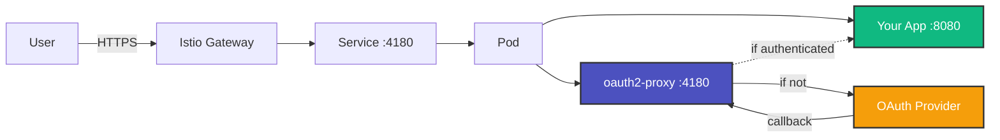
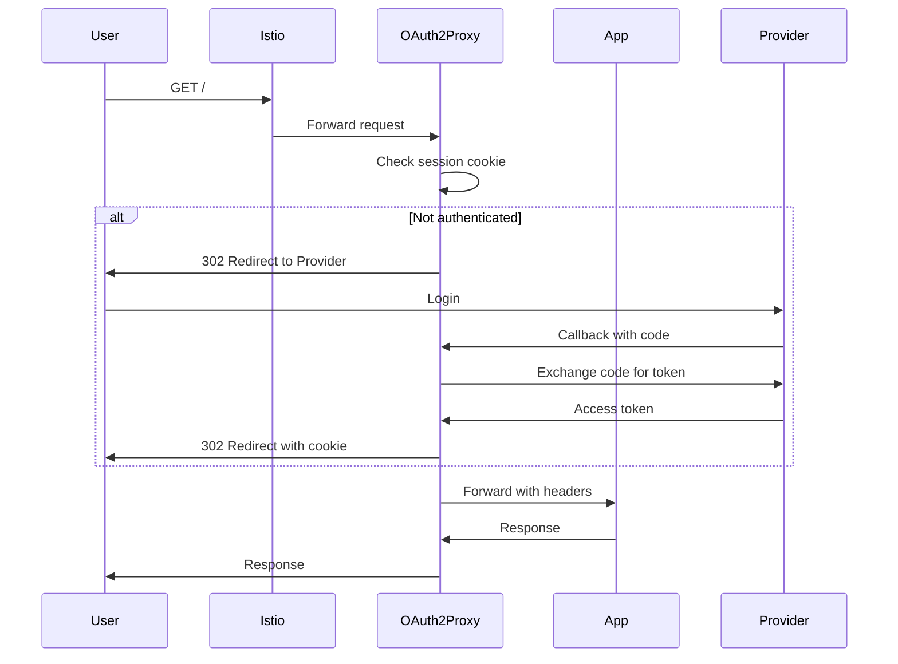

# OAuth2 Sidecar Proxy

<div class="grid cards" markdown>

-   :material-lock-outline:{ .lg .middle } __Secure by Default__

    ---

    OAuth2 authentication with industry-standard security practices. Support for GitHub, Google, Azure AD, and custom OIDC providers.

-   :material-scale-balance:{ .lg .middle } __Simple Architecture__

    ---

    Sidecar pattern eliminates complex centralized authentication services. Each app manages its own auth lifecycle.

-   :material-kubernetes:{ .lg .middle } __Kubernetes Native__

    ---

    Built for Kubernetes and Istio service mesh. Seamless integration with AKS and other managed Kubernetes platforms.

-   :material-lightning-bolt:{ .lg .middle } __SSO Out of the Box__

    ---

    Shared cookie domain enables single sign-on across all your applications automatically.

</div>

## Overview

OAuth2 Sidecar Proxy provides a simple, secure way to add OAuth2 authentication to your Kubernetes applications using the **sidecar pattern**. Each application pod includes an `oauth2-proxy` container that handles authentication before requests reach your application.



## Key Features

- **🔒 Secure**: OAuth2/OIDC authentication with support for major providers
- **🚀 Simple**: No complex ext_authz configuration required
- **🎯 Isolated**: Each app has its own authentication configuration
- **🔄 Portable**: Easy to migrate between clusters
- **🐛 Debuggable**: Auth logs co-located with application logs
- **🌐 SSO**: Single sign-on across all applications in your domain
- **🎨 Customizable**: Custom sign-in pages with your branding
- **📊 Observable**: Built-in metrics and health checks

## Quick Start

Get up and running in minutes:

```bash
# 1. Clone the repository
git clone https://github.com/ianlintner/authproxy.git
cd authproxy

# 2. Configure OAuth credentials
cp examples/simple-app/values.yaml my-values.yaml
# Edit my-values.yaml with your OAuth app credentials

# 3. Install with Helm
helm install oauth2-sidecar ./helm/oauth2-sidecar \
  --values my-values.yaml \
  --namespace default

# 4. Deploy example app
kubectl apply -k k8s/apps/example-app/

# 5. Test it!
curl https://example-app.your-domain.com
```

Your app is now protected with OAuth2 authentication! 🎉

## How It Works

The sidecar pattern places an `oauth2-proxy` container alongside your application container in the same pod:

1. **All traffic** first hits the oauth2-proxy sidecar on port 4180
2. **oauth2-proxy checks** for a valid session cookie
3. **If not authenticated**, redirects user to OAuth provider (GitHub, Google, etc.)
4. **If authenticated**, proxies the request to your app on localhost:8080
5. **User headers** are injected (email, username, etc.) for your app to use



## Architecture Benefits

### vs. Centralized Authentication

Traditional centralized authentication services (like a shared oauth2-proxy deployment with Istio ext_authz) require:

- Complex Istio configuration
- Shared state management
- Difficult debugging across services
- Tight coupling between apps

**Our sidecar approach provides:**

- ✅ **Simpler configuration** - No ext_authz filter needed
- ✅ **Better isolation** - Each app's auth is independent
- ✅ **Easier debugging** - Auth logs are with app logs
- ✅ **More flexible** - Different OAuth providers per app
- ✅ **More portable** - Apps can move between clusters easily

### Performance Considerations

The sidecar pattern adds minimal overhead:

- **Latency**: ~1-5ms for authenticated requests (localhost proxy)
- **Memory**: ~50-100MB per oauth2-proxy sidecar
- **CPU**: Minimal (<50m) for most workloads

Cookie-based sessions mean no database lookups on every request!

## Supported Platforms

- **Kubernetes**: 1.20+
- **Istio**: 1.14+ (including AKS Istio addon)
- **OAuth Providers**:
    - GitHub
    - Google
    - Azure AD / Microsoft Entra ID
    - Any OIDC-compliant provider
    - LinkedIn, Facebook, GitLab, and more

## What's Next?

<div class="grid cards" markdown>

-   [:material-rocket-launch: **Quick Start Guide**](getting-started/quickstart.md)
    
    Get your first authenticated app running in 5 minutes

-   [:material-book-open-variant: **Architecture Deep Dive**](architecture/overview.md)
    
    Understand how the sidecar pattern works

-   [:material-cog: **Configuration Reference**](reference/configuration.md)
    
    Complete guide to all configuration options

-   [:material-frequently-asked-questions: **Troubleshooting**](guide/troubleshooting.md)
    
    Common issues and how to solve them

</div>

## Community & Support

- **GitHub**: [Issues](https://github.com/ianlintner/authproxy/issues) | [Discussions](https://github.com/ianlintner/authproxy/discussions)
- **Documentation**: You're reading it!
- **Contributing**: See [Contributing Guide](contributing.md)

## License

This project is licensed under the MIT License - see the [LICENSE](https://github.com/ianlintner/authproxy/blob/main/LICENSE) file for details.
