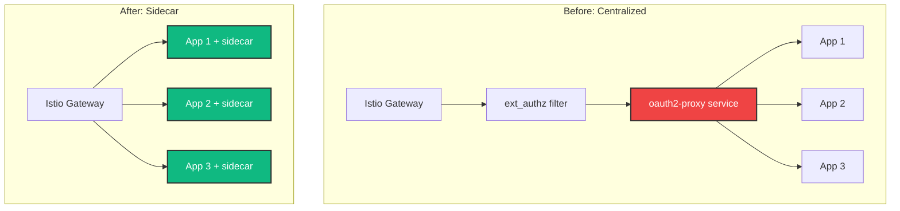

# Migration Guide

Migrating from centralized oauth2-proxy to the sidecar pattern.

## Overview

This guide helps you migrate from a centralized oauth2-proxy deployment (with Istio ext_authz) to the sidecar pattern.



## Benefits of Migration

- ✅ **Simpler architecture** - No ext_authz configuration
- ✅ **Better isolation** - Each app's auth is independent
- ✅ **Easier debugging** - Logs co-located with application
- ✅ **More flexible** - Different OAuth providers per app
- ✅ **More portable** - Apps can move between clusters

## Migration Steps

### 1. Install New Infrastructure

Install the sidecar-based infrastructure alongside the old one:

```bash
helm install oauth2-sidecar ./helm/oauth2-sidecar \
  --values migration-values.yaml
```

### 2. Migrate Applications One by One

For each application:

1. Add oauth2-proxy sidecar to deployment
2. Update service to port 4180
3. Create new VirtualService (or update existing)
4. Deploy and test
5. Remove old VirtualService/routes

### 3. Remove Centralized Infrastructure

Once all apps are migrated:

```bash
# Remove ext_authz filter
kubectl delete envoyfilter ext-authz-filter

# Remove centralized oauth2-proxy
kubectl delete deployment oauth2-proxy
kubectl delete service oauth2-proxy

# Remove authorization policies
kubectl delete authorizationpolicy oauth2-proxy-*
```

## Detailed Migration Example

### Before: Centralized Setup

```yaml
# EnvoyFilter with ext_authz
apiVersion: networking.istio.io/v1alpha3
kind: EnvoyFilter
metadata:
  name: ext-authz-filter
spec:
  workloadSelector:
    labels:
      istio: ingressgateway
  configPatches:
  - applyTo: HTTP_FILTER
    match:
      context: GATEWAY
      listener:
        filterChain:
          filter:
            name: "envoy.filters.network.http_connection_manager"
            subFilter:
              name: "envoy.filters.http.router"
    patch:
      operation: INSERT_BEFORE
      value:
        name: envoy.filters.http.ext_authz
        typed_config:
          "@type": type.googleapis.com/envoy.extensions.filters.http.ext_authz.v3.ExtAuthz
          http_service:
            server_uri:
              uri: http://oauth2-proxy.default.svc.cluster.local:4180
              cluster: outbound|4180||oauth2-proxy.default.svc.cluster.local
              timeout: 10s
```

### After: Sidecar Setup

```yaml
apiVersion: apps/v1
kind: Deployment
metadata:
  name: myapp
spec:
  template:
    spec:
      containers:
      # oauth2-proxy sidecar
      - name: oauth2-proxy
        image: quay.io/oauth2-proxy/oauth2-proxy:v7.6.0
        ports:
        - containerPort: 4180
        env:
        - name: OAUTH2_PROXY_REDIRECT_URL
          value: "https://myapp.example.com/oauth2/callback"
        - name: OAUTH2_PROXY_UPSTREAMS
          value: "http://127.0.0.1:8080"
        # ... credentials from secret
      
      # Your app
      - name: myapp
        image: myapp:latest
        ports:
        - containerPort: 8080
```

## Configuration Mapping

### Centralized Configuration

In centralized setup, configuration was in:
- EnvoyFilter spec
- oauth2-proxy deployment env vars
- Shared ConfigMap

### Sidecar Configuration

In sidecar setup, configuration is in:
- Shared ConfigMap (common settings)
- Per-deployment env vars (app-specific)

| Setting | Centralized | Sidecar |
|---------|------------|---------|
| Provider | Deployment env | ConfigMap |
| Client ID/Secret | Secret | Secret (same) |
| Redirect URL | Per-route | Per-pod env |
| Cookie domain | ConfigMap | ConfigMap |
| Upstream URL | EnvoyFilter | Per-pod env |

## Testing Migration

Test each application after migration:

```bash
# 1. Check pod is running
kubectl get pods -l app=myapp

# 2. Check both containers are ready
kubectl get pod myapp-xxx -o jsonpath='{.status.containerStatuses[*].ready}'

# 3. Test authentication
curl -v https://myapp.example.com/
# Should redirect to OAuth provider

# 4. Check logs
kubectl logs myapp-xxx -c oauth2-proxy
kubectl logs myapp-xxx -c myapp
```

## Rollback Plan

If issues occur, you can rollback:

```bash
# 1. Scale down new deployment
kubectl scale deployment myapp --replicas=0

# 2. Route traffic back to old setup
kubectl apply -f old-virtualservice.yaml

# 3. Verify old setup works
curl https://myapp.example.com/
```

## Common Migration Issues

### Issue: 503 Errors

**Cause**: VirtualService routing to wrong port

**Fix**: Ensure VirtualService routes to port 4180:

```yaml
http:
- route:
  - destination:
      host: myapp
      port:
        number: 4180  # Not 8080!
```

### Issue: Redirect Loop

**Cause**: Incorrect redirect URL or cookie domain

**Fix**: Verify environment variables:
```yaml
- name: OAUTH2_PROXY_REDIRECT_URL
  value: "https://myapp.example.com/oauth2/callback"  # Must match domain
- name: OAUTH2_PROXY_COOKIE_DOMAIN
  value: ".example.com"  # Leading dot for subdomains
```

### Issue: SSO Not Working

**Cause**: Different cookie domains between apps

**Fix**: All apps must use same cookie domain in ConfigMap.

## Cleanup Checklist

After successful migration:

- [ ] All applications migrated to sidecar pattern
- [ ] All applications tested and working
- [ ] Traffic verified on new setup
- [ ] Old EnvoyFilter removed
- [ ] Old oauth2-proxy deployment removed
- [ ] Old services removed
- [ ] Old authorization policies removed
- [ ] Documentation updated

## Next Steps

- [Configure custom templates](../guide/custom-templates.md)
- [Set up monitoring](../guide/troubleshooting.md#monitoring)
- [Review security settings](../architecture/security.md)
